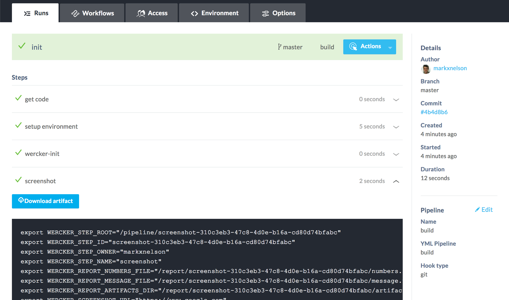

# step-screenshot

Take a screenshot of any web page.

[](https://app.wercker.com/project/bykey/d37a949330071d7817c95c29a8199996) 

## Dependencies

* phantomjs

## Example

Include this step in your pipeline at the location when you want to take 
a screenshot of a web page.

```yaml
box: markxnelson/phantomjs
build:
  steps:
      - screenshot:
          url: https://www.google.com
          filename: google.png
```

After your run has completed, you can access the screenshot(s) by using the
"Download artifact" button under the "screenshot" step in the run, as shown
in the image below:



The screenshot image can also be accessed from any subsequent steps using the
environment variable WERCKER_SCREENSHOT_TARGET_FILE.

Location of generated screenshot is decided as follows:
* file_path: Contains File name only, create_file_in_artifacts: false - Creates screenshot at top level in the source directory
* file_path: Contains File name only, create_file_in_artifacts: true - Creates screenshot at top level in the artifatcs directory
* file_path: Contains absolute path of file, create_file_in_artifacts: false - Creates screenshot at an absolute path in the box
* file_path: Contains relative path of file, create_file_in_artifacts: false - Creates screenshot at an relative path to source directory
* file_path: Contains relative path of file, create_file_in_artifacts: true - Creates screenshot at an relative path to the artifacts directory
* file_path: Contains absolute path of file, create_file_in_artifacts: true - Creates screenshot at an relative path to the artifacts directory (Leading forward / in the path is ignored)
